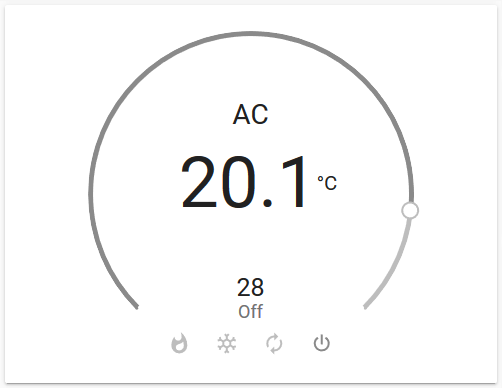

# Xiaomi Mi and Aqara Air Conditioning Companion

This is a custom component for home assistant to integrate the Xiaomi Mi and Aqara Air Conditioning Companion:

| Model ID          | Model number | Product name                            | Shape    |
|-------------------|--------------|-----------------------------------------|----------|
| `acpartner.v1`    | KTBL01LM     | Aqara Air Conditioning Companion        | square   |
| `acaprtner.v2`    | KTBL02LM     | Xiaomi Mi Air Conditioner Companion     | round    |
| `acpartner.v3`    | KTBL11LM     | Aqara Air Conditioning Companion        | square   |

Unsupported devices: `lumi.acpartner.mcn02`

Please follow the instructions on [Retrieving the Access Token](https://www.home-assistant.io/components/vacuum.xiaomi_miio/#retrieving-the-access-token) to get the API token to use in the configuration.yaml file.

Credits: Thanks to [Rytilahti](https://github.com/rytilahti/python-miio) for all the work.

## Features
* Power (on, off)
* Operation Mode (Heat, Cool, Auto, Dehumidify, Ventilate)
* Fan Speed (Low, Medium, High, Auto)
* Swing Mode (On, Off)
* Target Temperature
* Capture and replay infrared commands
* Attributes
  - ac_model
  - ac_power (on, off)
  - load_power (Wh)
  - operation_mode
  - fan_speed
  - swing_mode


## Install

You can install this custom component by adding this repository ([https://github.com/syssi/xiaomi_airconditioningcompanion](https://github.com/syssi/xiaomi_airconditioningcompanion/)) to [HACS](https://hacs.xyz/) in the settings menu of HACS first. You will find the custom component in the integration menu afterwards, look for 'Xiaomi Mi and Aqara Air Conditioning Companion Integration'. Alternatively, you can install it manually by copying the custom_component folder to your Home Assistant configuration folder.


## Setup

```yaml
# configuration.yaml

climate:
  - platform: xiaomi_miio_airconditioningcompanion
    name: Aqara Air Conditioning Companion
    host: 192.168.130.71
    token: b7c4a758c251955d2c24b1d9e41ce47d
    target_sensor: sensor.temperature_158d0001f53706
    scan_interval: 60
```



## Debugging

If the custom component doesn't work out of the box for your device please update your configuration to enable a higher log level:

```yaml
# configuration.yaml

logger:
  default: warn
  logs:
    custom_components.xiaomi_miio_airconditioningcompanion: debug
    miio: debug
```

## Platform services

#### Service `xiaomi_miio_airconditioningcompanion.climate_learn_command`

Capture an infrared command.

| Service data attribute    | Optional | Description                                                          |
|---------------------------|----------|----------------------------------------------------------------------|
| `entity_id`               |       no | Only act on a specific Xiaomi miIO fan entity.                       |
| `slot`                    |      yes | Storage slot. Defaults to slot ID 30.                                |
| `timeout`                 |      yes | Capturing timeout. Defaults to 10 seconds.                           |

#### Service `xiaomi_miio_airconditioningcompanion.climate_send_command`

Send captured infrared command or device configuration.

| Service data attribute    | Optional | Description                                                          |
|---------------------------|----------|----------------------------------------------------------------------|
| `entity_id`               |       no | Only act on a specific Xiaomi miIO fan entity.                       |
| `command`                 |       no | Infrared command. Must start with `FE` or `01`.                      |
